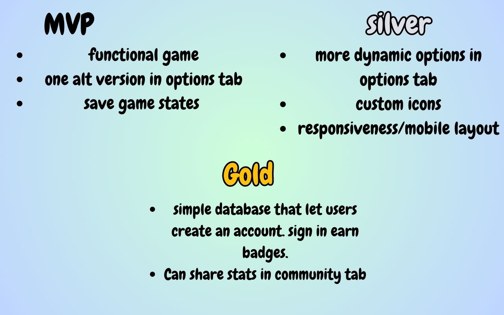

# [Tic Tac Toe](https://gabriellehandy.github.io/TicTacToe/)

Play tic tac toe with this fleshed-out web app!

## Installation

No installation is needed! 

## How I built the app
### TECH Used: HTML, CSS, JS, Bootstrap
- Started by using HTML and CSS to create the design and layout.
- I added JS to make it responsive and dynamic.
- I created an AI to play with, with buttons to toggle between Human and AI options
- I added extras like Name change, Music, and theme changing for a more personalized experience

## Wireframe
I was inspired by this website: [Pomodoro Kitty](https://pomodorokitty.com/)

## MVP, Silver, and Gold goals!

